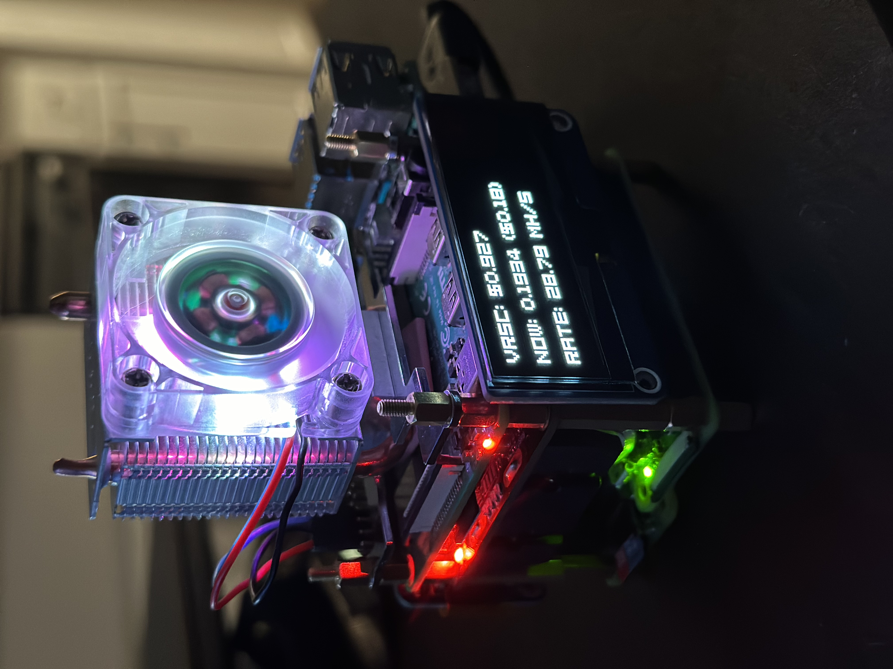

# Verus Ticker on Pi

# Materials
(x1) [Raspberry Pi Zero WH](https://amzn.to/49mZVxC) or [Zero 2 WH](https://amzn.to/3Ov69Dm) 
(x1) [Micro SD Cards](https://amzn.to/48bSKY8) 
(x1) [2.23inch OLED HAT](https://amzn.to/3V2gCKb) 
(x1) [90-degree GPIO extenders & splitter](https://amzn.to/3Uooea9) 

__Optional - to mine verus__  
(x1) [Raspberry Pi 5](https://amzn.to/3PGuwie)  
(x1) [Micro SD Cards](https://amzn.to/3uGUxX8) 
(x1) [CPU heatsink](https://amzn.to/3OGf84X) 

 
(Amazon affiliate links) 

## **Installations**

1. **OS install:**
   - Raspberry Pi Zero WH / 2 WH - Pi OS Lite 64-bit  
   - Raspberry Pi 5 - Pi OS Lite 64-bit

2. Set up 2.23inch OLED HAT (on Pi Zero) 

    _[Source](https://www.waveshare.com/wiki/2.23inch_OLED_HAT)_
    

3. Set up Verus mining (on Pi 5) 

    _[Source](https://github.com/monkins1010/ccminer/releases/tag/v3.8.3a)_
    
